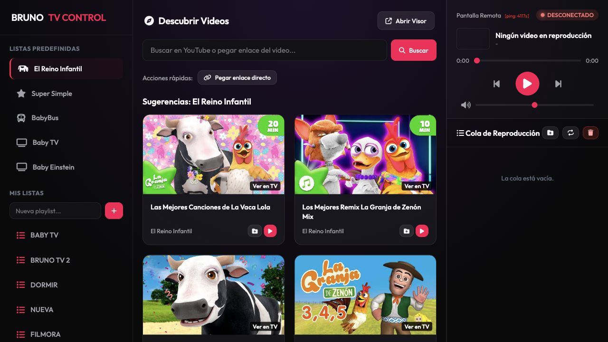
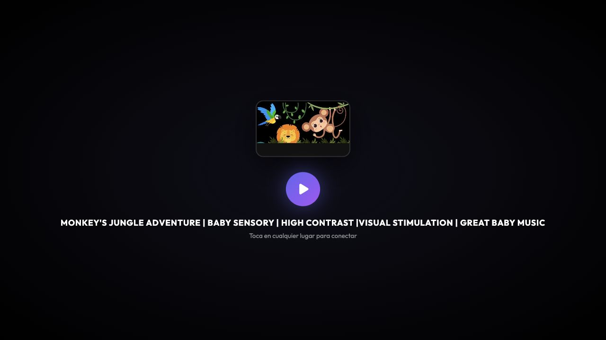

# Bruno TV Control



**Bruno TV Control** es una aplicacion web para buscar videos de YouTube, organizar listas y controlar una pantalla remota de reproduccion desde un panel principal.

[](https://intelector.com/bruno/)
[](https://intelector.com/bruno/player.html)
[](#)

## Vista general

El proyecto separa la experiencia en dos pantallas:

- **Control**: interfaz para buscar videos, crear listas, manejar la cola y controlar reproduccion, volumen y progreso.
- **Visor**: pantalla remota fullscreen pensada para TV, navegador secundario o dispositivo dedicado.



## Funciones

- Busqueda de videos de YouTube o carga directa por enlace.
- Listas predefinidas y listas personalizadas.
- Cola de reproduccion con acciones rapidas.
- Controles remotos de play, pausa, anterior, siguiente, volumen y progreso.
- Modo visor fullscreen para pantalla externa.
- Manifiestos PWA para instalar el control o el visor como app.

## Demos

- Panel de control: <https://intelector.com/bruno/>
- Visor remoto: <https://intelector.com/bruno/player.html>

> Nota: la ruta publica funcional del visor es `player.html`.

## Estructura

```text
.
|-- index.html              # Panel de control principal
|-- player.html             # Visor remoto fullscreen
|-- player_web.html         # Variante web del visor
|-- api.php                 # Endpoint auxiliar
|-- styles.css              # Estilos del proyecto
|-- manifest.json           # Manifest PWA del visor
|-- manifest_control.json   # Manifest PWA del control
`-- docs/                   # Imagenes usadas en el README
```

## Uso local

Abre `index.html` en el navegador para usar el panel de control.

Para la pantalla remota, abre `player.html` en el dispositivo o ventana donde quieras reproducir los videos.

